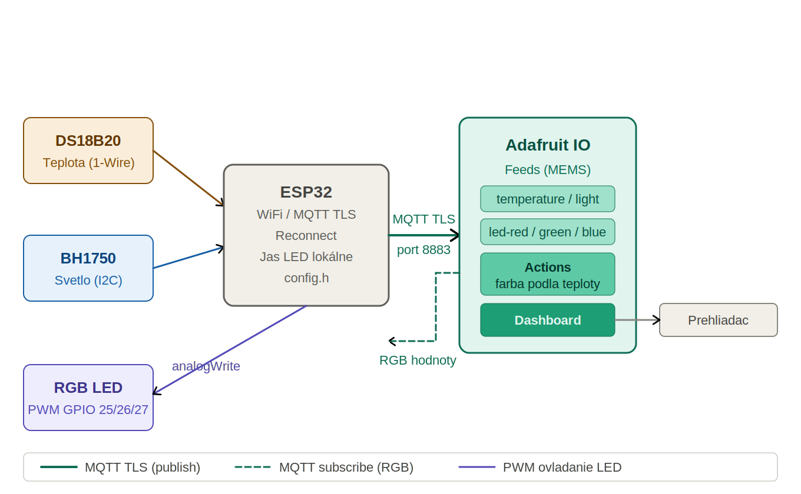
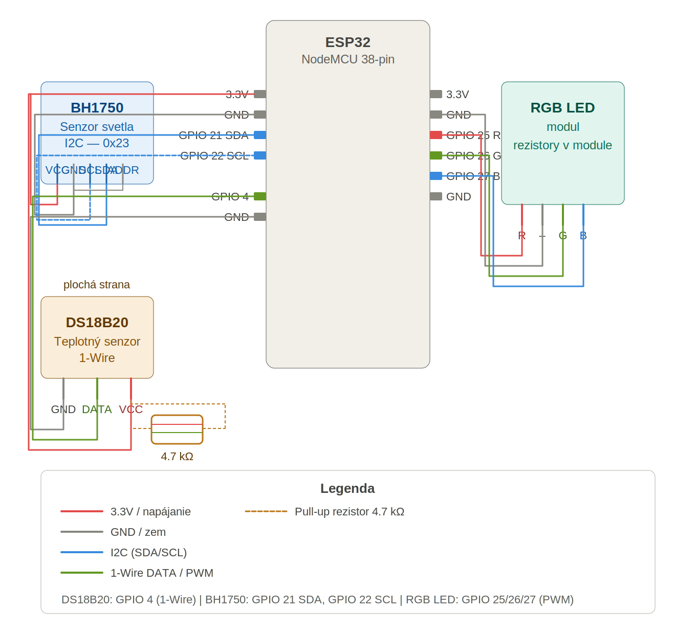

# ESP32 Sensor Monitor

Systém meria teplotu vzduchu a intenzitu okolitého svetla pomocou mikrokontroléra ESP32 a odosiela namerané hodnoty bezdrôtovo na cloudovú platformu Adafruit IO. Účelom projektu je demonštrovať end-to-end IoT riešenie — od fyzického senzora cez šifrovaný bezdrôtový prenos až po webovú vizualizáciu v reálnom čase. RGB LED modul poskytuje lokálnu vizuálnu spätnú väzbu: farba sa mení podľa teploty, jas podľa okolitého osvetlenia.

## Architektúra systému



```
[DS18B20] ──┐
            ├──► [ESP32] ──── WiFi / MQTT TLS (port 8883) ────► [Adafruit IO]
[BH1750]  ──┘                      │                                  │
                                   │ jas (lokálne)              Actions + Dashboard
[RGB LED] ◄────────────────────────┘◄─────── MQTT subscribe ──────────┘
```

- **Farba LED** — vypočítava Adafruit IO Actions podľa teploty (studená = modrá, teplá = červená)
- **Jas LED** — riadený lokálne na ESP32 podľa okolitého osvetlenia (tma = jasnejšie)

## Hardvér

| Komponent | Kategória | Popis | Protokol |
|---|---|---|---|
| ESP32 NodeMCU 38-pin (CP2102) | — | Hlavná platforma s integrovaným WiFi | — |
| DS18B20 | **A — digitálny** | Teplotný senzor ±0.5°C, rozsah −55 až +125°C | 1-Wire |
| BH1750 | **A — digitálny** | Senzor intenzity svetla 0–65535 lx, výstup v lux | I2C |
| RGB LED modul | — | Vizuálna spätná väzba, PWM riadenie | PWM |
| Rezistor 4.7 kΩ | — | Pull-up pre DS18B20 dátový pin | — |

> Oba senzory patria do **kategórie A** (digitálny výstup) — komunikujú priamo cez štandardné zbernice bez potreby ADC alebo kalibrácie.

## Schéma zapojenia



### DS18B20 — teplotný senzor

| Nožička DS18B20 | ESP32 pin | Poznámka |
|---|---|---|
| GND (ľavá) | GND | — |
| DATA (stred) | GPIO 4 | Pull-up rezistor 4.7 kΩ medzi DATA a 3.3V |
| VCC (pravá) | 3.3V | — |

### BH1750 — senzor svetla

| Pin BH1750 | ESP32 pin | Poznámka |
|---|---|---|
| VCC | 3.3V | — |
| GND | GND | — |
| SDA | GPIO 21 | I2C dáta (predvolený pin ESP32) |
| SCL | GPIO 22 | I2C hodiny (predvolený pin ESP32) |
| ADDR | GND | Nastavuje I2C adresu 0x23 |

### RGB LED modul

| Pin LED | ESP32 pin | Poznámka |
|---|---|---|
| R | GPIO 25 | Červený kanál — PWM |
| G | GPIO 26 | Zelený kanál — PWM |
| B | GPIO 27 | Modrý kanál — PWM |
| GND (–) | GND | Limitovacie rezistory sú integrované v module |

## Odôvodnenie výberu

| Rozhodnutie | Dôvod |
|---|---|
| **ESP32** | Integrovaný WiFi modul, dostatok RAM pre MQTT TLS stack, podpora I2C aj 1-Wire na ľubovoľných GPIO. Lacne|
| **DS18B20** namiesto NTC termistora | Digitálny výstup cez 1-Wire, presnosť ±0.5°C, nevyžaduje kalibráciu ani ADC prevodník. NTC termistor by vyžadoval ADC a kalibráciu. |
| **BH1750** namiesto fotoodporu | Výstup priamo v luxoch (0–65535 lx) cez I2C, nevyžaduje ADC ani kalibráciu. Fotoodpor by vyžadoval ADC a empirickú kalibráciu. |
| **MQTT over TLS** (port 8883) | Odľahčený protokol navrhnutý pre IoT s minimálnou réžiou. Podpora publish aj subscribe umožňuje obojsmernú komunikáciu. TLS šifruje prenos vrátane prihlasovacích údajov. |
| **Adafruit IO** | Bezplatná cloudová platforma s natívnou MQTT podporou, vstavaným dashboardom, automatickým ukladaním dát s časovou pečiatkou a verejným prístupom k dashboardu. |
| **Arduino IDE 2** | Rozsiahla komunita, dostupné knižnice pre všetky použité komponenty, jednoduché ladenie cez Serial Monitor (115200 baud). |
| **Perióda 15 sekúnd** | DS18B20 potrebuje ~750 ms na konverziu. Adafruit IO free tier obmedzuje na 30 správ/minútu — pri 2 feedoch je bezpečný interval 15 sekúnd. |
| **Jas LED lokálne na ESP32** | Adafruit IO Actions nepodporuje násobenie hodnôt dvoch feedov súčasne, preto je výpočet jasu implementovaný priamo vo firmvéri. |

## Inštalácia — od nuly po spustený systém

### Krok 1 — Adafruit IO účet a feedy

1. Zaregistrujte sa na [io.adafruit.com](https://io.adafruit.com)
2. Kliknite na **Feeds → + New Feed** a vytvorte skupinu **MEMS** s týmito feedmi:
   - `temperature`
   - `light`
   - `led-red`
   - `led-green`
   - `led-blue`
3. Kliknite na ikonu kľúča **🔑 My Key** a skopírujte **Active Key**
4. Zapamätajte si svoje **Username** (viditeľné v URL po prihlásení)

### Krok 2 — Adafruit IO Actions (automatické ovládanie LED)

Vytvorte 3 Actions v menu **Actions → + New Action → Reactive**:

| Action | Trigger feed | Vzorec (Map blok) | Cieľový feed |
|---|---|---|---|
| Red | MEMS: temperature | `Round(Map(value, 0→30, 0→255))` | MEMS: led-red |
| Green | MEMS: temperature | `Round(Map(value, 0→30, 50→0))` | MEMS: led-green |
| Blue | MEMS: temperature | `Round(Map(value, 0→30, 255→0))` | MEMS: led-blue |

### Krok 3 — Adafruit IO Dashboard

1. Kliknite na **Dashboards → + New Dashboard**, pomenujte ho `mems`
2. Otvorte dashboard a pridajte bloky tlačidlom **+**:
   - **Line Chart** → feed `mems.temperature` (nastavte jednotku °C)
   - **Line Chart** → feed `mems.light` (nastavte jednotku lx)
   - **Gauge** → feed `mems.temperature`
   - **Gauge** → feed `mems.light`
3. Nastavte dashboard ako verejný: **Settings → Privacy → Public**

### Krok 4 — Arduino IDE a knižnice

1. Stiahnite a nainštalujte [Arduino IDE 2](https://www.arduino.cc/en/software)
2. Otvorte `File → Preferences` a do poľa **Additional boards manager URLs** pridajte:
   ```
   https://raw.githubusercontent.com/espressif/arduino-esp32/gh-pages/package_esp32_index.json
   ```
3. Otvorte `Tools → Board → Boards Manager`, vyhľadajte **esp32** a nainštalujte **esp32 by Espressif Systems**
4. Nainštalujte knižnice cez `Sketch → Include Library → Manage Libraries`:
   - `BH1750` od Christopher Laws
   - `DallasTemperature` od Miles Burton
   - `OneWire` od Paul Stoffregen
   - `Adafruit MQTT Library` od Adafruit

### Krok 5 — Inštalácia ovládača CP2102

Ak Windows nerozpozná ESP32:
1. Stiahnite **CP210x Universal Windows Driver** zo stránky [silabs.com](https://www.silabs.com/developers/usb-to-uart-bridge-vcp-drivers)
2. Rozbaľte archív a spustite inštalátor
3. Po inštalácii by sa malo v Správcovi zariadení objaviť **Silicon Labs CP210x USB to UART Bridge (COMx)**

### Krok 6 — Konfigurácia projektu

1. Klonujte repozitár:
   ```bash
   git clone https://github.com/s4laTcezar/MISA.git
   cd MISA/TestESP
   ```
2. Skopírujte konfiguračný súbor:
   ```bash
   cp config.example.h config.h
   ```
3. Otvorte `config.h` a vyplňte svoje údaje:
   ```cpp
   #define WIFI_SSID      "nazov_vasej_siete"
   #define WIFI_PASSWORD  "heslo_vasej_siete"
   #define AIO_USERNAME   "vas_adafruit_username"
   #define AIO_KEY        "vas_active_key"
   ```

## Nahratie firmvéru do ESP32

1. Otvorte súbor `TestESP/TestESP.ino` v Arduino IDE 2
2. Vyberte dosku: `Tools → Board → ESP32 Arduino → ESP32 Dev Module`
3. Vyberte port: `Tools → Port → COMx (Silicon Labs CP210x)`
4. Kliknite na tlačidlo **→ Upload**
5. Ak sa zobrazí chyba pri nahrávaní, podržte tlačidlo **BOOT** na doske počas spúšťania nahrávania
6. Po úspešnom nahraní otvorte `Tools → Serial Monitor`, nastavte rýchlosť **115200 baud** a sledujte výpis:
   ```
   WiFi pripojené! IP: 192.168.x.x
   Pripájanie k Adafruit IO... pripojený!
   Teplota odoslaná: 23.4 °C
   Osvetlenosť odoslaná: 342.0 lx
   ```

## Formát prenášaných dát

Dáta sú prenášané ako jednotlivé číselné hodnoty cez MQTT na samostatné Adafruit IO feedy. Každá správa obsahuje jednu hodnotu a Adafruit IO automaticky pridáva časovú pečiatku (UTC).

| Feed | Smer | Typ | Jednotka | Príklad hodnoty |
|---|---|---|---|---|
| `mems.temperature` | ESP32 → Cloud | float | °C | `23.4` |
| `mems.light` | ESP32 → Cloud | float | lx | `342.0` |
| `mems.led-red` | Cloud → ESP32 | int | 0–255 | `210` |
| `mems.led-green` | Cloud → ESP32 | int | 0–255 | `12` |
| `mems.led-blue` | Cloud → ESP32 | int | 0–255 | `45` |

**Príklad MQTT správy** (topic `s4lat/feeds/mems.temperature`):
```
23.4
```

Dáta sú odosielané každých **15 sekúnd** (definované v `config.h` ako `SEND_INTERVAL`).

## Prístup k webovému rozhraniu

Verejný dashboard je dostupný bez prihlásenia:

```
https://io.adafruit.com/s4lat/dashboards/mems
```

Dashboard zobrazuje:
- aktuálnu teplotu s časovou pečiatkou (Gauge)
- aktuálnu osvetlenosť s časovou pečiatkou (Gauge)
- históriu teploty za posledných 30 dní (Line Chart)
- históriu osvetlenosti za posledných 30 dní (Line Chart)

## Štruktúra repozitára

```
/
├── TestESP/
│   ├── TestESP.ino         # Hlavný sketch — setup() a loop()
│   ├── config.example.h    # Šablóna konfigurácie (bez hesiel)
│   ├── config.h            # Vaša konfigurácia (nie je v repozitári)
│   ├── wifi_manager.h      # Pripojenie WiFi + automatický reconnect
│   ├── mqtt_manager.h      # Adafruit IO MQTT — publish + subscribe + TLS
│   ├── sensors.h           # Čítanie DS18B20 a BH1750 s ošetrením chýb
│   └── led.h               # PWM ovládanie RGB LED
├── docs/
│   ├── schema.png          # Schéma zapojenia senzorov
│   └── architecture.png    # Diagram architektúry systému
├── .gitignore
└── README.md
```